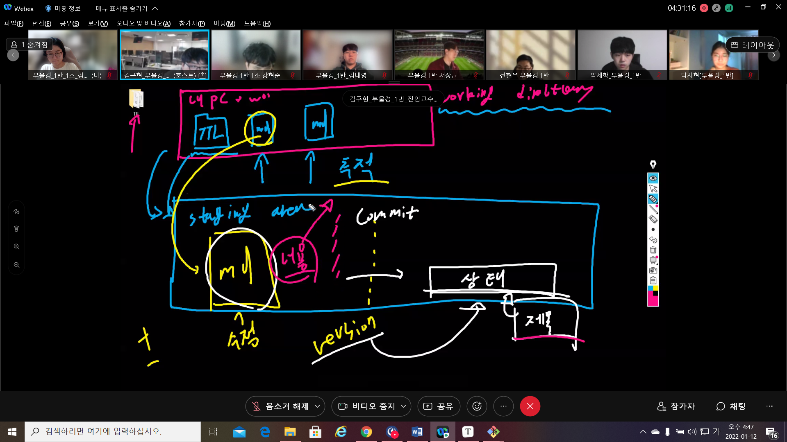

## GIT

초기 설정

- 최초 한 번만 설정합니다.

1. 누가 커밋을 남겼는지 확인할 수 있도록 이름과 이메일을 설정합니다. *축약문 --

```bash
$ git config --global user.name 이름
$ git config --global user.email 이메일
```

2. 설정된 내용 확인

   ``` bash
   $ git config --global --list
   # or
   $ git config --global --l
   ```

   

working directory를 git으로 관리하기 위한 초기화 작업이 필요함 

git을 통해서 파일을 관리하는 행위를 시작을 할거고 til 폴더안에 여러 파일이 있을 때 git이 staging are에서 이러한 파일들을 추적하는 것 -> git에서 파일의 수정여부를 기록 -> staging area에 git의  


제목이라는 파일들을 상태를 추적을 내용이라는 것이 추가가 된것만 기억해서 그 상태로 커밋을 하면 새로운 추가된 내용과 상태가 합쳐짐





추적 상태로 만드는 명령어가 add commit 깃으로 관리하겠다

깃에서 발생한 수정사항들을 버전으로 만드는게 커밋임

버전들을 쌓아나가는 것 까지가 git이 해주는 일임


원격저장소에는 수정된 파일만 넣음 원격 저장소 깃허브에 밀어넣는 명령어는 push

## git init

- 현재 작업 중이 directory git으로 관리

### 주의사항

- 이미 master로 관리중인 폴더 내에서 절대 절대 절대 git init 금지


## git status

- Working directory와 staging area에 있는 파일들의 현재 상태를 확인
- 상태
  1. `untracked` : git이 관리하지 않는 파일
  2. `tracked`:git이 관리하는 파일
     1. `unmodified`:최신상태
     2. `modified`:수정되었지만 staging area에 반영되기 전 상태 = 버전이 커밋 전
     3. `staged`: staging area에 반영된 상태


### git add

```bash
# 특정 파일
$ git add file_name.txt

# 특정 폴더
$ git add folder/

#현재 디렉토리에 속한 모든 파일/폴더
$ git add .
```


## git commit

- staging area에 올라온 파일의 변경사항을 하나의 버전으로 저장하는 명령어
- `커밋 메세지`는 현재 변경사항을 기록하는 용도로 사용합니다.

``` bash
$ git commit -m "커밋 메세지"
```


## git log

- 커밋의 내역을 조회할 수 있는 명령어
- 옵션
  - `--oneline`:한줄로 축약해서 보여줌
  - `--graph` : 브랜치와 머지 내력을 그래프로 보여주는 명령어
  - `--all` : 모든 브랜치의 내역
  - `--reverse` : 커밋 내역의 순서를 반대로 보여주는 명령어
  - 

